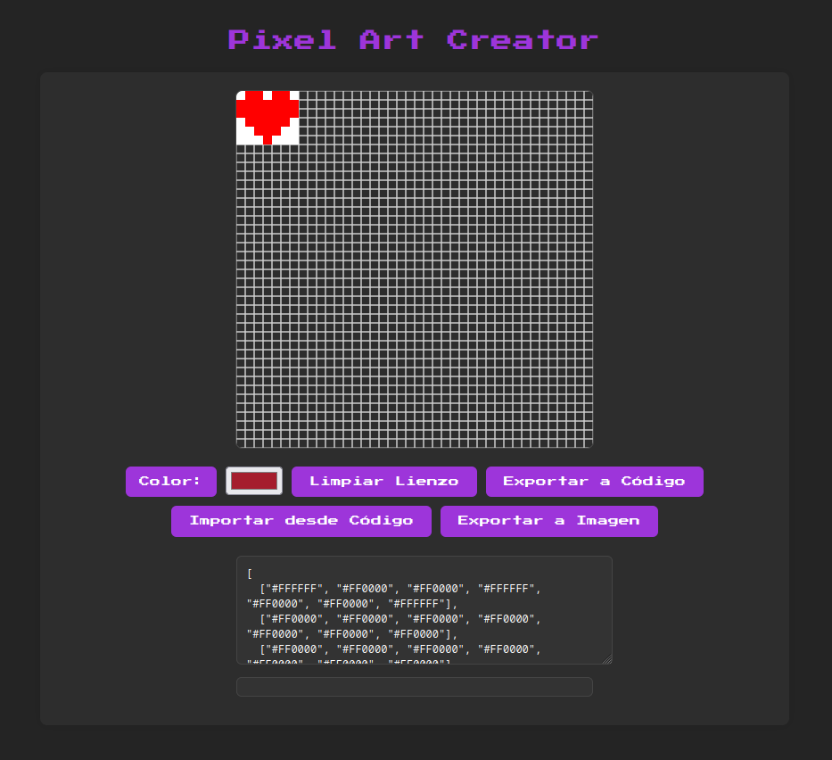

# Code To Pixel 🎨

¡Bienvenido al **Code to Pixel**! Una herramienta web para crear y editar pixel art de manera fácil y divertida. Convierte código en imágenes y viceversa, exporta tus creaciones y disfruta de una interfaz inspirada en el estilo GNOME con modo claro y oscuro.

 <!-- Reemplaza con una imagen real de tu proyecto -->

---

## Características ✨

- **Lienzo interactivo**: Dibuja píxeles con un solo clic.
- **Conversión de código a imagen**: Importa imágenes desde código JSON.
- **Conversión de imagen a código**: Exporta tu pixel art a código JSON.
- **Exportación de imágenes**: Guarda tus creaciones como PNG.

---

## Cómo usar 🛠️

### 1. Clona el repositorio
```bash
git clone https://github.com/8medios/code-to-pixel.git
cd code-to-pixel
```

### 2. Abre el proyecto
Abre el archivo `index.html` en tu navegador web.

### 3. Crea tu pixel art
- **Pintar**: Haz clic en el lienzo para pintar píxeles.
- **Cambiar color**: Usa el selector de color en la barra de herramientas.
- **Limpiar lienzo**: Usa el botón "Limpiar Lienzo" para empezar de nuevo.

### 4. Importar desde código
Pega un código JSON en el área de texto y haz clic en "Importar desde Código". Ejemplo de código:
```json
[
  ["#FFFFFF", "#FF0000", "#FF0000", "#FFFFFF"],
  ["#FF0000", "#FF0000", "#FF0000", "#FF0000"],
  ["#FFFFFF", "#FF0000", "#FF0000", "#FFFFFF"]
]
```

### 5. Exportar a código
Haz clic en "Exportar a Código" para obtener el código JSON de tu diseño.

### 6. Exportar a imagen
Haz clic en "Exportar a Imagen" para descargar tu pixel art como un archivo PNG.

---

## Ejemplo de Código JSON 🖼️

Aquí tienes un ejemplo de código JSON para probar:
```json
[
  ["#FFFFFF", "#FF0000", "#FF0000", "#FFFFFF", "#FF0000", "#FF0000", "#FFFFFF"],
  ["#FF0000", "#FF0000", "#FF0000", "#FF0000", "#FF0000", "#FF0000", "#FF0000"],
  ["#FF0000", "#FF0000", "#FF0000", "#FF0000", "#FF0000", "#FF0000", "#FF0000"],
  ["#FFFFFF", "#FF0000", "#FF0000", "#FF0000", "#FF0000", "#FF0000", "#FFFFFF"],
  ["#FFFFFF", "#FFFFFF", "#FF0000", "#FF0000", "#FF0000", "#FFFFFF", "#FFFFFF"],
  ["#FFFFFF", "#FFFFFF", "#FFFFFF", "#FF0000", "#FFFFFF", "#FFFFFF", "#FFFFFF"]
]
```

---

## Tecnologías utilizadas 💻

- **HTML5**: Estructura de la aplicación.
- **CSS3**: Estilos y diseño responsive.
- **JavaScript**: Lógica del lienzo y funcionalidades.
- **Google Fonts**: Fuente "Press Start 2P" para el estilo retro.

---

## Cómo contribuir 🤝

¡Las contribuciones son bienvenidas! Si quieres mejorar este proyecto, sigue estos pasos:

1. Haz un fork del repositorio.
2. Crea una rama para tu feature: `git checkout -b feature/nueva-funcionalidad`.
3. Haz commit de tus cambios: `git commit -m 'Añade nueva funcionalidad'`.
4. Haz push a la rama: `git push origin feature/nueva-funcionalidad`.
5. Abre un pull request.

---

## Licencia 📄

Este proyecto está bajo la licencia **MIT**. Consulta el archivo [LICENSE](LICENSE) para más detalles.

---

¡Diviértete creando pixel art! 🎮✨
